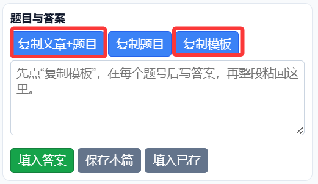
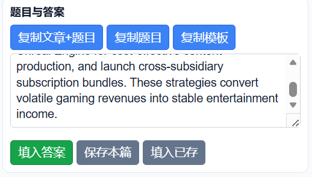

# 51Learning Helper

[](https://github.com/zhourunfaaaaaa/51learning-helper/raw/master/51learning-helper.user.js)
[](LICENSE)

篡改猴（Tampermonkey）脚本，辅助 [51Learning](http://reading.51learning.com.cn:8080/) 阅读平台完成学习流程。

**注意：本脚本不会自动生成答案，也不会自动提交。所有答案需要你自行确认后填入。**

## 功能

- **单元队列收集** — 自动抓取整个单元的文章列表，支持翻页遍历
- **上一篇/下一篇导航** — 在队列中快速切换文章，记录阅读位置
- **自动模式选择** — 一键设置阅读显示模式、单位、速度
- **词数估算计时 + 自动完成阅读** — 根据文章词数和阅读速度自动计算时长，到时间后自动点击"完成阅读"
- **复制文章+题目** — 一键复制文章内容和题目到剪贴板
- **答案模板** — 生成结构化的答案模板（含题号、题型分组），填好答案后粘贴回脚本即可一键填入
- **答案保存/加载** — 按文章保存答案到本地，下次打开同一篇可恢复
- **计时同步** — 自动检测网页已有的阅读计时并同步到插件

## 安装

### 第一步：安装篡改猴

篡改猴（Tampermonkey）是一个浏览器扩展，用于管理和运行用户脚本。

1. 打开浏览器扩展商店：
   - **Edge**：[Tampermonkey](https://microsoftedge.microsoft.com/addons/detail/tampermonkey/iikmkjmpaadaobahmlepeloendndfphd)
   - **Chrome**：[Tampermonkey](https://chromewebstore.google.com/detail/tampermonkey/dhdgffkkebhmkfjojejmpbldmpobfkfo)
   - **Firefox**：[Tampermonkey](https://addons.mozilla.org/firefox/addon/tampermonkey/)
2. 点击"获取"/"添加到浏览器"，等待安装完成
3. 浏览器工具栏出现篡改猴图标（拼图块样式）即安装成功

### 第二步：安装本脚本

1. 打开 [51learning-helper.user.js](https://github.com/zhourunfaaaaaa/51learning-helper/raw/master/51learning-helper.user.js)，篡改猴会自动弹出安装页面
2. 或手动安装：篡改猴图标 → 管理面板 → 实用工具 → **导入 URL**，粘贴脚本地址：
```
https://github.com/zhourunfaaaaaa/51learning-helper/raw/master/51learning-helper.user.js
```
3. 点击安装确认即可

### 第三步：开始使用

打开 [51Learning 阅读平台](http://reading.51learning.com.cn:8080/Reading/Articles)，页面右上角出现控制面板。

## 使用流程

### 第一步：收集文章列表

1. 进入单元列表页（`/Reading/Articles?b=...&u=...`）
2. 在控制面板确认 `b` 和 `u` 参数正确
3. 点击 **"收集单元"**
4. 脚本自动遍历所有分页，收集全部文章

### 第二步：开始阅读

1. 选择文章后进入文章页，或通过面板的 **"上一篇"/"下一篇"** 导航
2. 确认阅读模式（显示方式、单位、速度）正确
3. 点击 **"选模式并开始"**
4. 脚本自动设置模式并点击"开始阅读"，同时根据文章词数和阅读速度启动计时

### 第三步：完成阅读

1. 计时到达后自动点击 **"完成阅读"**
2. 题目出现后，点击 **"复制文章+题目"** 或 **"复制模板"**
3. 将内容发送给 AI（如deepseek）帮你生成答案

### 第四步：填入答案

1. 按模板格式填好答案，粘贴到控制面板的文本框
2. 点击 **"填入答案"**，脚本自动填写所有输入框
3. **自行检查答案正确性**
4. 手动点击网站的 **"提交答案"**

> **重要：每篇文章题型不同（填空、选择、翻译、匹配等组合不一样），使用一键填入前必须先点"复制模板"获取对应模板，填完答案再粘回脚本。**

## 答案模板格式
```
51Learning答案模板
填写方法：不要改【】标题；每题一行，把答案写在题号后面。
填空/匹配/选择题写字母；翻译/问答题写完整句子。

【vocabulary 词汇填空】
1. A
2. D
3. C

【multiple_choice 选择题】
1. B
2. A

【translation 翻译】
1. The article mainly discusses...
2. According to the text...
```


## 使用教程

### 第一步：复制题目和答案模板

文章阅读完成后，题目出现。点击控制面板的 **"复制模板"** 按钮，获取与当前题型匹配的答案模板。也可以点 **"复制文章+题目"** 把文章和题目一起复制。



### 第二步：将内容发送给大模型

将复制的模板（或文章+题目）粘贴到 AI 工具（如 deepseek、豆包、Kimi 等），告诉它按照模板格式填写答案。


### 第三步：获取大模型生成的答案

AI 会按照题型分组和题号返回填写好的答案。


### 第四步：将答案粘贴到脚本

把 AI 生成的答案完整复制，粘贴到控制面板的文本框内。



### 第五步：一键填入答案

点击 **"填入答案"** 按钮，脚本自动将答案填写到网页对应的输入框。**检查确认无误后**，手动点击网站的"提交答案"按钮。


## 数据存储

所有数据存储在浏览器的 `localStorage` 中，不会上传到任何服务器：
- 队列列表
- 已读标记
- 答案缓存
- 配置项

## 开发

```
git clone https://github.com/zhourunfaaaaaa/51learning-helper.git
```

直接编辑 `51learning-helper.user.js`，在 Tampermonkey 中导入本地文件即可调试。

## License

MIT
